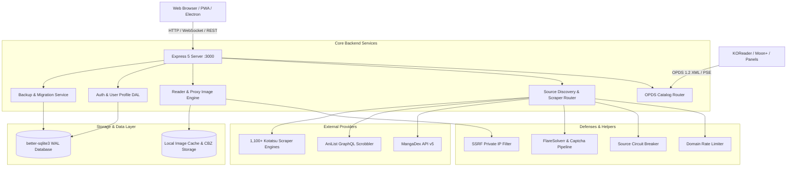

# Graywood Reader

<div align="center">

[](LICENSE)
[](package.json)
[](tsconfig.json)
[](package.json)
[-003B57.svg?style=flat-square&logo=sqlite&logoColor=white)](sqlite-db.ts)
[](tests/)
[](server/routes/opds.ts)
[](public/manifest.webmanifest)

**A high-performance, private, self-hosted manga, manhwa, and manhua library manager with a Kotatsu-inspired reader.**

[Key Features](#-features) • [Quick Start](#-quick-start) • [Architecture](#-architecture) • [Deployment](#-deployment) • [OPDS Catalog](#-opds-12-catalog-server) • [Legal Disclaimer](#-legal-disclaimer) • [License](#-license)

</div>

---

> ⚡ **Development & Heritage**: This project is **heavily inspired by the best open-source manga applications** across the reading ecosystem — including **[Kotatsu](https://github.com/KotatsuApp/Kotatsu)**, **[Tachiyomi / Mihon](https://github.com/mihonapp/mihon)**, **[Suwayomi](https://github.com/Suwayomi/Suwayomi-Server)**, **[Paperback](https://github.com/Paperback-iOS)**, and **[Komga](https://github.com/gotson/komga)**.

Graywood Reader is a single-binary-capable Node.js + React application powered by `better-sqlite3` in Write-Ahead Logging (WAL) mode. It combines multi-source scraping across 1,100+ community parsers, MangaDex API v5 metadata enrichment, AniList live progress tracking, offline IndexedDB chapter downloads, and a full OPDS 1.2 catalog server for e-readers — all protected behind automated anti-bot defense pipelines, AES-256-GCM credential encryption, and SSRF mitigations.

---

## ✨ Features

### 📚 Smart Library & Collection Tracking
- **Granular Statuses**: Organize titles into `Reading`, `Completed`, `Plan to Read`, `On Hold`, and `Dropped` shelves.
- **Unread & Release Badges**: Real-time unread chapter counts, release date tracking, and automated chapter update feeds.
- **Multi-Select Batch Actions**: Floating toolbar for bulk status assignment, bulk mark-as-read, shelf categorization, and mass deletion.
- **Favorites, Flags & Custom Tags**: Star favorites, flag broken sources with automated recovery, rate series, and manage personal tags.

### 📖 Kotatsu-Inspired Reader Experience
- **Multiple Reading Modes**:
  - **Webtoon (Long Strip)**: Continuous vertical strip with seamless 0px gap mode and standard margin mode.
  - **Japanese Manga Right-to-Left (RTL)**: Traditional right-to-left paging.
  - **Left-to-Right (LTR)**: Western comic reading layout.
  - **Single Page View**: Focused single page presentation.
  - **Double-Page Book Spread**: Intelligent dual-page pairing with automatic cover offset detection.
- **Guided Smart Panel View**: Snap-to-panel micro-navigation optimized for vertical webtoon strips.
- **Hardware-Accelerated Shader Filters**: Normal, Line-Art Sharpener, E-Ink (e-paper high-contrast mode), OLED Ultra-Dark, Warm Sepia, and Grayscale.
- **Private Sticky Notes**: Anchor personal thoughts, theories, and notes to specific chapter pages with instant jump-to-page navigation.
- **Instant Next Chapter Prefetch**: Zero-latency chapter transitions via intelligent background prefetching.
- **Granular 60 FPS Auto-Scroll**: Configurable smooth micro-stepping with countdown auto-progression.

### 🔍 Multi-Source Discovery & Metadata Enrichment
- **1,100+ Kotatsu Parser Sources**: Search and browse across Madara, MangaThemesia, WPComics, FoolSlide, and custom HTML scraper engines.
- **Rich Metadata Providers**: MangaDex API v5, AniList GraphQL, MangaUpdates, Kitsu, OpenLibrary, and Google Books integration.
- **Local CBZ / Folder Archives**: Index and read personal offline `.cbz`, `.zip`, and image folder collections directly.

### 💾 100% Offline Reading & Portable Backups
- **Client-Side IndexedDB Storage**: Cache complete chapters directly inside the browser for offline reading on mobile or desktop without internet access.
- **Server Storage & CBZ Downloads**: Save chapters to disk as standard `.cbz` archives.
- **Tachiyomi / Mihon Backups**: Full bidirectional import and export support for Tachiyomi v2 / Mihon JSON backup files.
- **One-Click Server Migrations**: Export and import complete instance state (database, settings, profiles, notes) as a timestamped `.zip` archive.

### 🛡️ Bot Defense, Privacy & Self-Hosting Security
- **Automated Anti-Bot Pipeline**: FlareSolverr proxy bridge and 2Captcha/CapSolver integration for bypassing Cloudflare Turnstile and DDoS challenges.
- **AES-256-GCM PII Encryption**: Sensitive API keys, session tokens, and scraper credentials are encrypted at rest.
- **SSRF Network Protection**: Built-in IP validation restricts scraper and image proxy requests from targeting private subnets (RFC 1918), loopback, and link-local ranges.
- **Role-Based Access Control**: Configurable multi-user authentication (`admin` and `user` roles) with host-gate verification.

### 📡 OPDS 1.2 Catalog Server & E-Reader Integration
- Standard **OPDS 1.2 acquisition feeds** with **Page Streaming Extension (PSE)** at `/api/opds/catalog.xml`.
- Compatible out-of-the-box with **KOReader**, **Moon+ Reader**, **Panels (iOS)**, **Paperback**, and other OPDS clients.

---

## 🚀 Quick Start

### Prerequisites
- **Node.js**: `≥ 22.12.0` (LTS recommended)
- **npm**: `≥ 10.0.0`
- **Git**

### 1. Clone & Install
```bash
git clone https://github.com/gogz95/Remix-ManhuaSync-to-a-reader.git
cd Remix-ManhuaSync-to-a-reader
npm install
```

### 2. Local Development
```bash
# Start API backend + Vite HMR development server
npm run dev
```
Open **`http://localhost:3000`** in your browser.

### 3. Production Build & Run
```bash
# Build frontend bundle (dist/) + backend bundle (dist-server/server.cjs)
npm run build

# Start the production server
npm run start
```

---

## ⚙️ Environment Variables

Copy `.env.example` to `.env` and configure your environment:

```bash
cp .env.example .env
```

| Variable | Description | Default |
|---|---|---|
| `PORT` | HTTP server listening port | `3000` |
| `HOST` | Bind address (`127.0.0.1` for desktop/local, `0.0.0.0` for containers) | `0.0.0.0` |
| `ENCRYPTION_SECRET` | 32+ character high-entropy key for PII and credential encryption | *Generated on first run if omitted* |
| `REQUIRE_AUTH` | Enforce multi-user session authentication for non-loopback clients (`1` or `0`) | `0` |
| `STORAGE_PATH` | Server-side directory for offline downloads, caches, and backups | `./data` |
| `GEMINI_API_KEY` | Optional — Enables AI-assisted series search, smart tagging, and recommendations | *None* |

---

## 🐳 Deployment

### Docker Compose (Recommended)
```bash
# 1. Build container image
npm run docker:build

# 2. Start container with persistent data volume
npm run docker:run
```
Data persists in `./data/manga.db`.

### PM2 Process Manager
```bash
npm run build
npm run pm2:start
```

### Standalone Desktop Executable (Windows)
```bash
npm run build:exe
```
Generates a standalone installer and portable `.exe` in `dist-electron/`.

---

## 🏗️ Architecture



### Directory Structure
```
Graywood-Reader/
├── server.ts                    # Express 5 API + OPDS 1.2 server + scrapers
├── sqlite-db.ts                 # better-sqlite3 DAL (manga, profiles, reading progress, notes)
├── server/
│   ├── captchaSolver.ts         # Cloudflare Turnstile & 2Captcha solver orchestrator
│   ├── circuitBreaker.ts        # Source failure backoff and circuit breaker
│   ├── rateLimit.ts             # IP rate-limiting & DDoS mitigation
│   ├── security.ts              # AES-256-GCM PII encryption, SSRF filter & token auth
│   ├── routes/                  # REST controllers (auth, manga, reader, sources, opds, gdpr)
│   └── services/                # Crawler engine, metadata enrichers, download manager
├── src/
│   ├── App.tsx                  # Root application controller & lazy module router
│   ├── components/              # Reader, Library, Settings, Browse, Modals
│   ├── hooks/                   # Custom React hooks (useReaderSession, useKeyboardNav)
│   └── utils/                   # IndexedDB cache, Tachiyomi parser, AniList scrobbler
├── public/                      # PWA Web Manifest, service worker, icons
└── tests/                       # 40+ Vitest test suites (380+ tests)
```

For full details on data isolation, zero-data guarantees, and persistence paths, see [`STORAGE.md`](STORAGE.md).

---

## 📡 OPDS 1.2 Catalog Server

Graywood Reader exposes a standards-compliant OPDS 1.2 catalog for e-readers:

- **Root Catalog Feed**: `http://<server-ip>:3000/api/opds/catalog.xml`
- **Search Feed**: `http://<server-ip>:3000/api/opds/search?q={searchTerms}`
- **Shelf Feeds**: Reading, Completed, Plan to Read, On Hold, Dropped
- **Page Streaming Extension (PSE)**: Supported for zero-download page-by-page streaming on compatible readers (e.g. Panels).

---

## 📜 NPM Scripts

| Script | Purpose |
|---|---|
| `npm run dev` | Start development server with Vite HMR (`tsx server.ts`) |
| `npm run build` | Full production build (`vite build` + `build:server`) |
| `npm run start` | Run compiled production bundle (`node dist-server/server.cjs`) |
| `npm run lint` | Run TypeScript type checking across all files (`tsc --noEmit`) |
| `npm test` | Run complete unit and integration test suite with Vitest (`vitest run`) |
| `npm run reader:smoke` | Run live scraper smoke tests against configured sources |
| `npm run build:exe` | Package Windows standalone desktop executable |
| `npm run docker:build` | Build production Docker image |
| `npm run docker:run` | Start Docker Compose container |

---

## 🤝 Contributing & Community

Contributions are what make the open-source community an amazing place to learn, inspire, and create.
- **Contributing Guidelines**: See [`CONTRIBUTING.md`](CONTRIBUTING.md) for local setup, development commands, and architecture details.
- **Code of Conduct**: See [`CODE_OF_CONDUCT.md`](CODE_OF_CONDUCT.md) for community standards and pledge.
- **Security Policy**: See [`SECURITY.md`](SECURITY.md) for vulnerability reporting and self-hosting security practices.
- **Active Bug Tracker**: See [`BUGS.md`](BUGS.md) for tracked issues and resolutions.
- **Roadmap**: See [`ROADMAP.md`](ROADMAP.md) for upcoming features and architectural plans.

---

## 💖 Acknowledgements & Inspirations

This project is deeply indebted to and inspired by the incredible work of the open-source manga community:

- **[Kotatsu](https://github.com/KotatsuApp/Kotatsu)** — For the reader interface, sliding window image caching concepts, and Kotlin parser ecosystem.
- **[Tachiyomi](https://github.com/tachiyomiorg) / [Mihon](https://github.com/mihonapp/mihon)** — For standardizing manga tracking, backup formats, and extensions.
- **[Suwayomi-Server](https://github.com/Suwayomi/Suwayomi-Server)** — For pioneering self-hosted server architectures for manga.
- **[Paperback](https://github.com/Paperback-iOS)** & **[Komga](https://github.com/gotson/komga)** — For OPDS acquisition feeds and modern library UX design.
- **[MangaDex](https://mangadex.org)** — For their public API v5 powering title search, covers, and metadata enrichment.

---

## ⚖️ Legal Disclaimer

**Graywood Reader** is an open-source, self-hosted indexer, catalog manager, and reader application. It is provided strictly as a technical tool for organizing, browsing, and reading content that users already have access to or that is made available publicly on the internet.

- **No Content Hosting or Distribution**: The developers, maintainers, and contributors of Graywood Reader do not host, store, stream, publish, or distribute any copyrighted media, manga, manhwa, manhua, or comic chapters on any central server, cloud service, or within this repository.
- **Third-Party Sources & Parsers**: All parser definitions, scraper scripts, and API connectors are technical instructions designed to interpret publicly accessible web documents and endpoints. The developers have no ownership, affiliation, control, or partnership with any third-party websites or scanlation groups.
- **Local Caching & User Control**: Any temporary image proxying, browser storage (`IndexedDB`), or offline downloads (`STORAGE_PATH`) operate exclusively on the user's own local hardware or self-hosted server environment, executed solely at the user's direction.
- **User Responsibility**: Users assume full responsibility for how they use this software, including verifying that their access and storage of materials comply with applicable local copyright laws, intellectual property rights, and the terms of service of the third-party websites they access.
- **Copyright & DMCA Notices**: Because Graywood Reader is a standalone client software application that does not host or transmit media files through any developer-owned infrastructure, any copyright infringement claims or takedown notices regarding specific content must be directed to the third-party web hosts and source operators actually hosting the media.

For the full legal terms, see [`DISCLAIMER.md`](DISCLAIMER.md).

---

## 📄 License

**Graywood Reader** is free software licensed under the **GNU General Public License v3.0 or later** (`GPL-3.0-or-later`). See [`LICENSE`](LICENSE) for the full text.

Third-party dependencies and vendored parser licenses are documented in [`THIRD-PARTY-NOTICES.md`](THIRD-PARTY-NOTICES.md) and [`NOTICE`](NOTICE).
